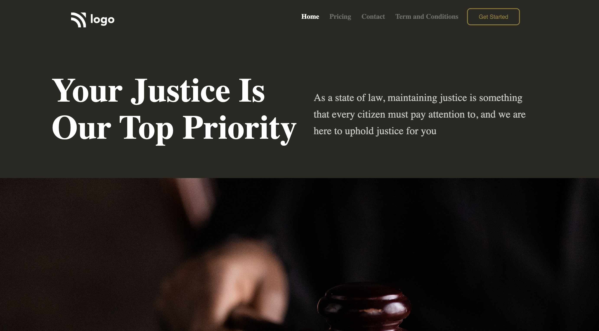

# Law Home Page Project 👨‍⚖️ 👨‍⚖️

[Law Home Page Project](https://law-home-page-htmlcss.netlify.app/)

 
 

This project developed with pure HTML and CSS mainly focused on positions.

Welcome to the Law Home Page project, a website designed and developed with pure HTML and CSS to create a professional and informative online presence for legal services. This project is hosted on Netlify and aims to provide a clean and user-friendly interface for individuals seeking legal information or services.

### Technologies Used
 

 

1. HTML: The backbone of the project, HTML is used to structure the content, ensuring a semantic and accessible layout.

2. CSS: Cascading Style Sheets are employed to style the HTML elements, creating a visually cohesive and aesthetically pleasing design.

### Features

1. Clean and Professional Layout:The layout is crafted to convey a sense of professionalism, with organized sections for easy navigation.

2. Informative Content: The use of HTML allows for the structured presentation of legal information, making it easy for users to find the details they need.

### Project Structure

The HTML structure follows best practices for semantic markup, enhancing accessibility and search engine optimization. The CSS styling focuses on creating a visually appealing design while maintaining a professional aesthetic.

### Conclusion

The Law Home Page project showcases the capabilities of HTML and CSS in creating a functional and aesthetically pleasing website for legal services. As the project evolves, consider incorporating additional features, dynamic content, or even interactivity to enhance the user experience.

Visit the Law Home Page to explore the website

### Demo :

### You can Check it Live on Below Link :

[Live Link !](https://law-home-page-htmlcss.netlify.app/)